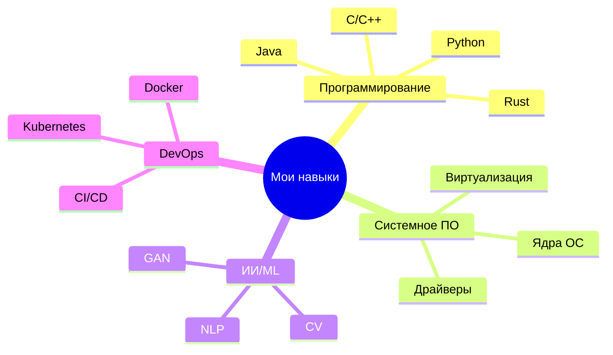
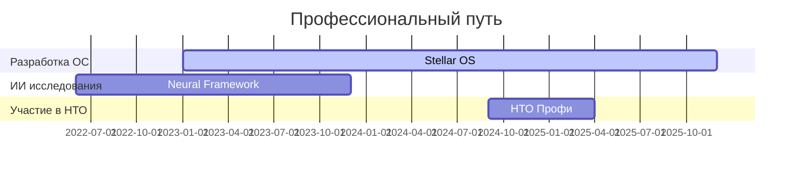
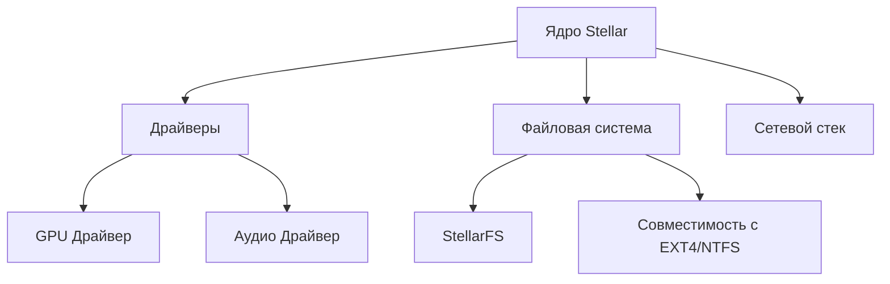

<!-- Анимированный титул с последовательным выводом строк -->
<div align="center" style="margin: 0 auto; display: flex; justify-content: center; align-items: center;">
  
</div>

<table align="center">
  <tr>
    <td>
      <!-- Аватарка -->
      
    </td>
    <td>
      <!-- Текстовая часть -->
      <h2 style="color: #00AAFF; margin: 0; padding: 0;">SeramonGreat</h2>
      <p style="color: #6E48AA; margin-top: 8px; font-size: 18px; line-height: 1.5;">
        🚀 Разработчик Stellar OS<br>
        💻 Создаю будущее через код<br>
        🤖 AI/ML | 🏆 НТО 2025<br>
        ✨ Инноватор России!
      </p>
    </td>
  </tr>
</table>



<div align="center">
  
</div>

## 🚀 **Обо мне**  
Приветствую! 👋 Я **Серафим**, профессиональный разработчик программного обеспечения с более чем 3-летним опытом в создании сложных IT-решений. Моя страсть - разработка системного ПО и искусственный интеллект.  

🔭 **Основные направления деятельности:**  
- 🖥️ **Разработка операционных систем**: Создание Stellar OS с нуля (ядро, драйверы, системные утилиты)  
- 🤖 **Исследования в области ИИ**: Разработка нейросетевых моделей для обработки естественного языка  
- 🏆 **Технические соревнования**: Победитель и призер НТО, хакатонов по системному программированию  
- 🔧 **Open-source вклад**: Активное участие в развитии open-source проектов  

🎯 **Профессиональные принципы:**  
- 💡 Инновационный подход к решению задач  
- 🛠️ Качественный и оптимизированный код  
- 📚 Постоянное обучение новым технологиям  
- 🤝 Сотрудничество с IT-сообществом  

📚 **Образование:**  
- 🎓 Академия цифровых технологий (Санкт-Петербург)  
- 📖 Самообразование через курсы и документацию  
- 🏅 Сертификаты по машинному обучению и системному программированию  

🌱 **Сейчас изучаю:**  
- 🦀 Язык программирования Rust для системного ПО  
- 🧠 Генеративные нейросетевые модели  
- 🔐 Кибербезопасность и криптографию  

  

  <!-- Анимированная карта коммитов -->
  

<!-- Вращающиеся значки -->
<div align="center">
  
</div>

## 🛠 **Технологический стек**
### **Языки программирования**
     

### **Фреймворки и инструменты**
     


## 🌌 **Stellar — Система Нового Поколения**
🚀 **Stellar** — это **инновационная ОС** с гибридным ядром, высокой производительностью и современным интерфейсом.

### **✨ Особенности**
✅ **Гибридное ядро** (монолитное + микроядро)  
✅ **Совместимость** с Windows/Linux/macOS  
✅ **Высокая безопасность** (изолированные модули)  
✅ **Поддержка множества языков** (🇷🇺🇬🇧🇩🇪🇨🇳 и др.)


## 📊 **Статистика GitHub**


## 📫 **Связь**
🔹 **Основные контакты:**  
[](https://t.me/SeramonGreat)  
[](mailto:serlap09@gmail.com)  
[](https://github.com/SeramonGreat)  


## 🔥 **Поддержка проекта**
💖 **Хотите помочь?**  
⭐ **Поставьте звезду на GitHub!**  
💸 **Поддержать разработку:** [GitHub Sponsors](https://github.com/sponsors/SeramonGreat)

<!-- Интерактивные карточки с hover-эффектами -->
<div align="center">
  <a href="#">
    
  </a>
</div>

## 🌟 **Ключевые компетенции**
<!-- Анимированные карточки навыков -->
<div align="center">
  
  
  
</div>

## 📊 **Метрики разработки**
<!-- Интерактивные графики -->
<div align="center">
  
  
  
</div>

## 🕰 **Опыт работы**


## 🎮 **Интерактивные элементы**
```python
# Нажмите ▶️ чтобы выполнить код
import random

class DevLife:
    def __init__(self):
        self.skills = ["AI", "OS Dev", "Web", "Cloud"]
        self.level = 99
    
    def code(self):
        return random.choice(["Bug", "Feature", "Optimization"])

me = DevLife()
print(f"Сегодня я написал: {me.code()}")
```


## 🌌 **Stellar OS Deep Dive**
<details>
<summary><b>🚀 Нажмите для просмотра архитектуры</b></summary>
  

</details>

<div align="center">
  
  
</div>

<!-- Анимированные разделители -->


```python
# Пример кода на Python (AI-модель)
import tensorflow as tf

model = tf.keras.Sequential([
    tf.keras.layers.Dense(128, activation='relu'),
    tf.keras.layers.Dense(10, activation='softmax')
])

model.compile(optimizer='adam', loss='sparse_categorical_crossentropy')
print("Stellar AI is ready! 🚀")
```

## 🚀 **Вперед к новым горизонтам!**
<div align="center">
  
</div>

💫 **Благодарю за посещение моего профиля!**  
⭐ **Если вам понравились мои проекты - поставьте звезду на GitHub!**  
🤝 **Буду рад сотрудничеству и новым знакомствам в IT-сфере!**

